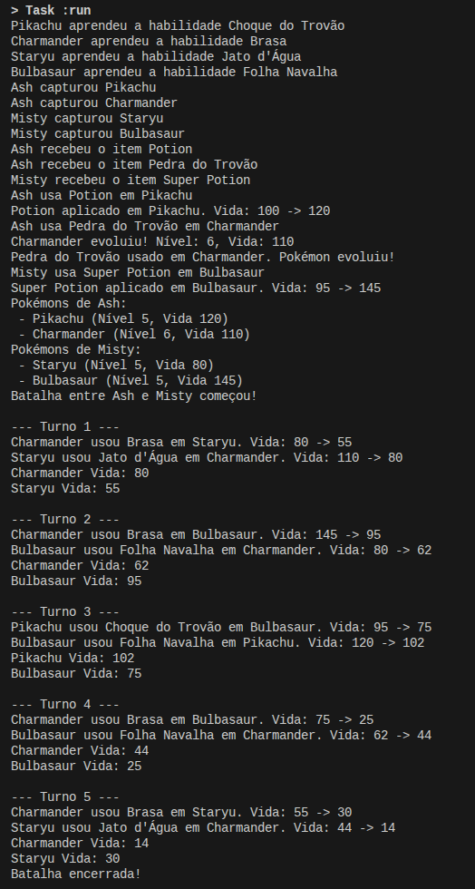

# Pokemon Simulator

Simples simulador de batalha Pokemon em Java usando Gradle.

## Estrutura do projeto

- Classes: Pokémon, Treinador, Habilidade, Itens, Batalha e App.java

## Pré-requisitos

- Java 21+ instalado
- Gradle instalado

## Como executar

1. Compile e rode com Gradle:

```bash
gradle run
```

## Output

